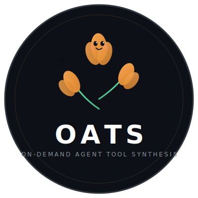
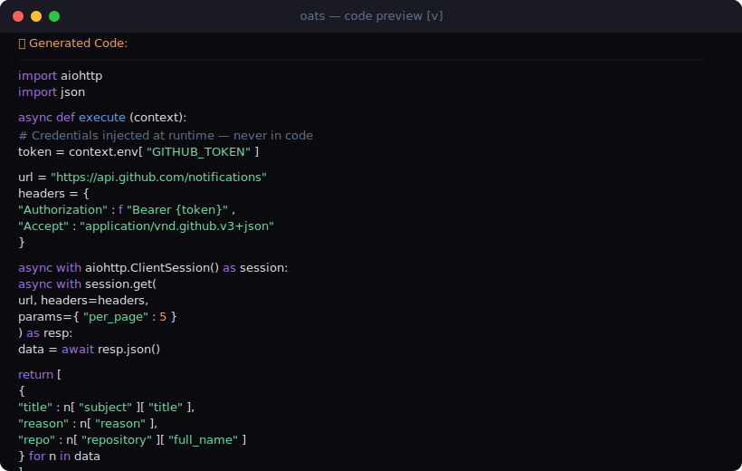

<p align="center">
  
</p>

<h1 align="center">OATS</h1>
<h3 align="center">On-demand Agent Tool Synthesis</h3>

<p align="center">
  <strong>LLMs don't pick from a menu. They cook what they need.</strong> 🌾
</p>

<p align="center">
  <a href="https://github.com/agentic-work/oats/actions"></a>
  <a href="https://pypi.org/project/oats-ai/"></a>
  <a href="https://github.com/agentic-work/oats/blob/main/LICENSE"></a>
  <a href="https://github.com/agentic-work/oats/stargazers"></a>
  <a href="https://discord.gg/agenticwork"></a>
  
</p>

<p align="center">
  <a href="https://oats.agenticwork.io">Website</a> &bull;
  <a href="https://oats-docs.agenticwork.io">Docs</a> &bull;
  <a href="https://oats-docs.agenticwork.io/getting-started">Getting Started</a> &bull;
  <a href="https://oats-docs.agenticwork.io/capabilities">Capabilities</a> &bull;
  <a href="https://discord.gg/agenticwork">Discord</a> &bull;
  <a href="https://github.com/agentic-work/oats/discussions">Discussions</a>
</p>

---

## The Synthesizer in Your Stack 🌾

**OATS** is a Python framework that lets LLMs **synthesize custom tools on-the-fly** instead of being limited to pre-registered tool menus. Every synthesized tool requires **mandatory human approval** before execution. No YOLO mode. No implicit trust.

```
Traditional:  Tools (how to call APIs) → LLM picks from a fixed menu
OATS:         Capabilities (what exists) → LLM synthesizes the right tool, fresh
```

Static MCP servers and tool registries are a fixed recipe book. OATS is an organic synthesizer — describe what's available, and the LLM grows exactly the tool it needs. Every output gets human-approved before it runs.

<p align="center">
  
</p>

---

## Quick Start

```bash
pip install oats-ai
```

```python
from oats import CapabilityRegistry, Synthesizer, Executor, HITLGate, Capability, CapabilityAuth, AuthType
from oats.hitl import CLIApprovalHandler

# Register what's available (capabilities), not how to use it (tools)
registry = CapabilityRegistry()
registry.register(Capability(
    name="github",
    description="Access GitHub API",
    auth=CapabilityAuth(type=AuthType.BEARER, token_env_var="GITHUB_TOKEN"),
    allowed_domains=["api.github.com"],
))

# The LLM synthesizes a tool from natural language
synthesizer = Synthesizer(llm_client=your_client, capability_registry=registry)
tool = await synthesizer.synthesize("fetch my last 5 GitHub notifications")

# Human approves before anything runs
gate = HITLGate(handler=CLIApprovalHandler())
decision = await gate.submit_for_approval(tool)

if decision.approved:
    output = await Executor().execute(tool)
    print(output.result)  # Your notifications
```

Or use the CLI:

```bash
# Synthesize a tool from intent
oats synth "fetch my last 5 github notifications"

# List available capabilities
oats caps list

# Show capability details
oats caps show github
```

---

## Why OATS?

### The Problem

Every AI framework makes you pre-register tools with exact schemas. That means:

- **Schema debt** — tools accumulate, overlap, rot
- **Developer bottleneck** — every new capability needs code
- **Auth complexity** — one-time operations still need full plumbing
- **LLM straitjacket** — models can only do what you've pre-built

### The Inversion

OATS flips it. You describe **capabilities** (what APIs, services, and resources exist), and the LLM **synthesizes exactly the tool it needs** for each request. One-shot. Ephemeral. Human-approved.

| | Traditional Tools | OATS |
|---|---|---|
| Registration | Pre-define every tool | Describe capabilities |
| Schema | Fixed, rigid | Synthesized per-request |
| Auth | Per-tool configuration | Scoped credential injection |
| Lifecycle | Permanent, accumulates | One-shot, discarded |
| Human oversight | Optional | **Mandatory** |

---

## Core Concepts

### 1. Capabilities, Not Tools 🌾

A capability says WHAT is available. The LLM figures out HOW:

```yaml
capabilities:
  - name: github
    description: Access GitHub API for repo management, issues, PRs, notifications
    auth:
      type: bearer
      scopes: [repo:read, repo:write, notifications:read]
      token_env_var: GITHUB_TOKEN
    allowed_domains: [api.github.com]
    rate_limit: 100/hour
```

Built-in capabilities: `http`, `filesystem`, `shell`, `github`, `slack`, `json`, `datetime`, `data`

### 2. Human-in-the-Loop Gate 🚪

Every. Single. Tool. Gets. Approved.

```
┌─────────────────────────────────────────────────────────┐
│  🌾 OATS Tool Approval [MEDIUM RISK]                    │
├─────────────────────────────────────────────────────────┤
│  INTENT: Fetch my last 5 GitHub notifications            │
│                                                          │
│  EXPLANATION: Calls GitHub REST API to retrieve           │
│  notifications for the authenticated user.               │
│                                                          │
│  CAPABILITIES: github                                    │
│  AUTH SCOPES: notifications:read                         │
│                                                          │
│  [y] Approve  [n] Deny  [v] View Code  [e] Edit         │
└─────────────────────────────────────────────────────────┘
```

Risk levels: `LOW` | `MEDIUM` | `HIGH` | `CRITICAL`

### 3. Sandboxed Execution 🔒

- Code validation blocks dangerous patterns (`eval()`, `os.system()`, `subprocess.Popen()`)
- Scoped credentials injected as env vars — never in synthesized code
- Resource limits: timeout, memory caps
- Isolated subprocess execution

### 4. One-Shot by Design ♻️

Tools are synthesized, approved, executed, and **discarded**. No schema debt. No zombie tools. If you need a permanent tool, that's what MCP servers are for. OATS handles the long tail of one-time operations your pre-built tools can't cover.

---

## Architecture

```
┌─────────────┐
│ User Intent  │    "fetch my github notifications"
└──────┬──────┘
       ▼
┌─────────────┐
│  Capability  │    What's available? github API with bearer auth
│  Registry    │
└──────┬──────┘
       ▼
┌─────────────┐
│ Synthesizer  │    LLM generates: async code + risk + schema
│   (LLM)     │
└──────┬──────┘
       ▼
┌─────────────┐
│  HITL Gate   │    Human reviews code, approves or denies
│  🌾 APPROVE │
└──────┬──────┘
       ▼
┌─────────────┐
│  Sandboxed   │    Isolated execution, scoped credentials
│  Executor    │
└──────┬──────┘
       ▼
┌─────────────┐
│  Grounding   │    Results embedded for semantic search
│  Pipeline    │
└─────────────┘
```

## Supported LLM Providers

| Provider | Status | Model |
|----------|--------|-------|
| Anthropic Claude | **Default** | claude-sonnet-4-20250514 |
| AWS Bedrock | Supported | Any Bedrock model |
| OpenAI-compatible | Supported | GPT-4o, o3, etc. |
| Ollama | Supported | Local models |
| AgenticWork API | Supported | Platform routing |

---

## Installation

```bash
# Core
pip install oats-ai

# With GPU-accelerated embeddings
pip install oats-ai[gpu]

# With vector store (ChromaDB)
pip install oats-ai[embeddings]

# Everything
pip install oats-ai[all]

# From source (for contributors)
git clone https://github.com/agentic-work/oats.git
cd oats
pip install -e ".[dev]"
```

**Requirements:** Python 3.11+

---

## Integration

OATS works standalone or as a component in larger systems:

- **Claude Code** — expose via MCP server (`oats mcp serve`)
- **OpenClaw** — dynamic tool synthesis for multi-agent workflows
- **AgenticWork Platform** — native integration with SSO credential injection
- **Any agent framework** — use as a Python library

```python
# As an MCP server for Claude Code
from oats.mcp import serve
serve(port=8080)
```

### OATS + OpenClaw 🦞🌾

OpenClaw gives agents the ability to reason and coordinate. OATS gives them the ability to synthesize tools on-demand. Together, agents handle any task — with every tool human-approved before execution.

```python
from openclaw import Agent
from oats import OATSToolProvider

agent = Agent(
    tools=[OATSToolProvider(capabilities=["github", "slack", "jira"])],
    hitl_gate=True,
)

# Agent synthesizes tools on-the-fly as it works
result = await agent.run("Triage the last 10 GitHub issues and post a summary to #eng")
```

<p align="center">
  
</p>

---

## Development

```bash
git clone https://github.com/agentic-work/oats.git
cd oats
pip install -e ".[dev]"

# Run tests
pytest

# Type checking
mypy oats

# Linting
ruff check oats
```

---

## Design Principles

1. **No Implicit Trust** — LLMs hallucinate. Humans approve everything.
2. **Capabilities, Not Tools** — Describe what's available, let the LLM synthesize how.
3. **Scoped Credentials** — Never in code. Injected at runtime. Revocable.
4. **Ephemeral by Design** — One-shot tools don't accumulate schema debt.
5. **Grounded Output** — Results are embedded for platform-wide semantic search.

---

## Roadmap

- [x] Core synthesis loop
- [x] HITL approval gate
- [x] Sandboxed execution
- [x] Multi-provider LLM support
- [x] Capability registry with YAML definitions
- [x] CLI interface
- [x] MCP server mode
- [ ] Web-based approval UI
- [ ] Tool caching (opt-in promotion to permanent)
- [ ] Deno/WASM sandbox
- [ ] Capability marketplace
- [ ] VS Code extension

---

## License

MIT — see [LICENSE](LICENSE)

---

<p align="center">
  
  <br />
  <strong>OATS</strong> — Sow the seeds. Reap the tools. 🌾
  <br />
  <sub>Built by <a href="https://agenticwork.io">AgenticWork</a></sub>
</p>
